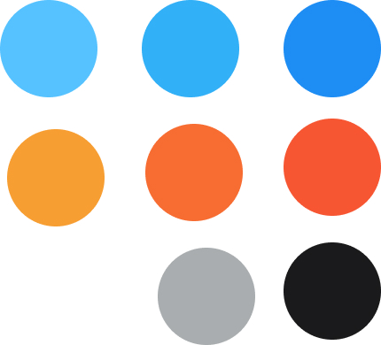
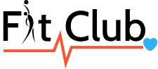
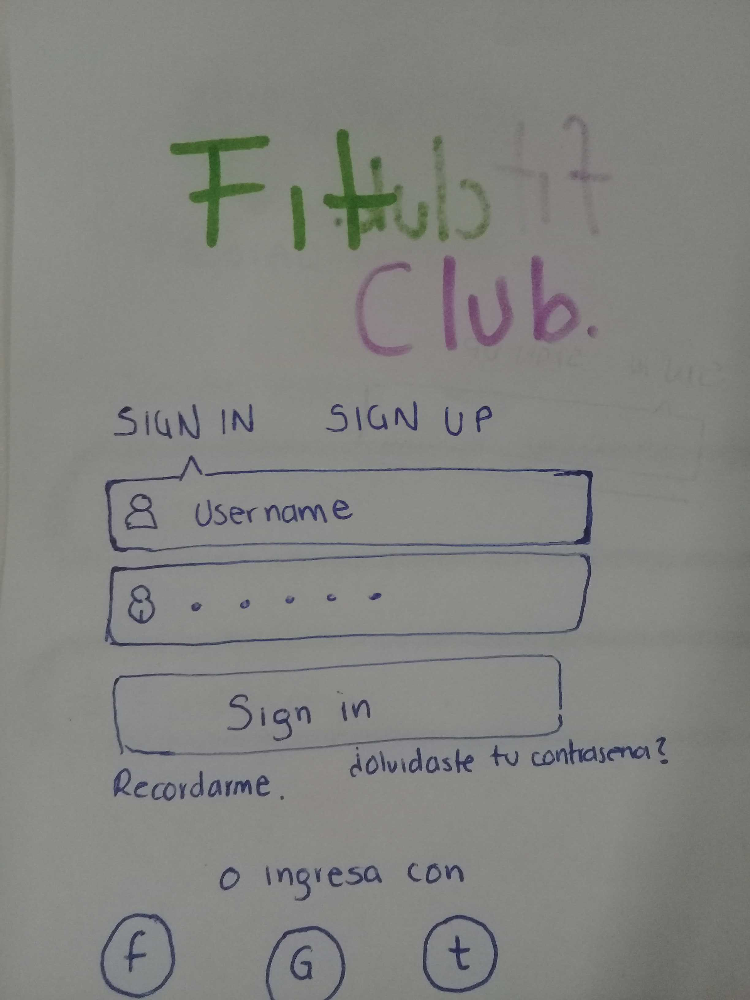

# Red social Fit Club

## Problemática

Solo el 42% de la población en México hace ejercicio según una investigación del periódico el Universal del año 2018. Como se va incrementando la edad las personas dejan de ejercitarse. 

El 59.6% de las personas que practican algún deporte o hacen ejercicio lo hacen por salud, el 19% por diversión y el 17.6% su motivación es verse bien. 

Por esta razón nace **Fit Club**, una red social que ayude a personas a conectarse con otras con el mismo interés que es cuidar su salud. Una manera rápida de conocer temas profesionales sobre nutrición, rutinas de ejercicio y tips para llevar un mejor estilo de vida. 

## Usuario

**Edad: de 25 a 35 años**
**Género: mixto**

Nuestro usuario le gusta hacer ejercicio asiste a gimnasio o paga membresía de uno, se siente motivado a cuidar su salud, por lo que le interesa una red social donde pueda encontrar información, tips, entrenamientos, conocer personas con intereses similares. Así como también conocer a profesionales en el área que le puedan ayudar a conocer sus objetivos. Y que pueda publicar paginas e información de interés.

## Historias de usuarios

1. Como usuario nuevo me gustaría poder crear una cuenta nueva con un correo electrónico, que me permita crear una contraseña y que guarde mis datos para que de esa manera no tenga que escribirlos cuando desee entrar nuevamente.

Criterios de aceptación

    • Si el mail no es reconocido ver un mensaje de error
    • el mensaje de error se debe resaltar en letras rojas 
    • debo ver la pagina en celular y en pantalla

2. Como usuario me gustaría poder seguir a las personas de la red social que me motivan y dar likes a sus historias, para poder hacer un seguimiento de sus publicaciones.

Criterios de aceptación

    • Ver notificaciones 
    • cuando de like a alguien que cambie de color el botón
    • debo regresar a la pagina de inicio solo con un botón sin recargar la página

3. Como usuario me gustaría tener un chat que me permita comunicarme en privado con algún instructor o nutriólogo que este en la red.

Criterios de aceptación

    • Que el chat de opción de estar disponible o no 
    • debe de dar opción de  minimizar 
    • debe desplegar opciones de personas para elegir con quien chatear

4. Como usuario me gustaria poder publicar contenido, dar likes, buscar personas en la red, comentar publicaciones y compartir.

Criterios de aceptación

## Entrevistas

Entrevista a 4 personas, las cuales llevan una vida saludable y les gusta hacer ejercicio.

**¿Te gustaría ver consejos y progresos de otros?**

R 1= Sí, por inspiración
R 2= Sí, por motivación
R 3= No, o probablemente para conocer la competencia si estoy en un torneo 
R 4= Sí, para ver sus cuerpos

**¿Te gustaría ser guiado por un doctor?**

R 1=  Sí, que valide mi progreso
R 2=  Mas bien por un instructor
R 3=  Por un Doctor atlético y un Instructor atlético 
R 4=  Por un instructor

**¿Te gustaría conocer a más personas que, al igual que tu, les gusta llevar una vida saludable?**

R 1= No lo considero relevante 
R 2= Sí, por que me motivan
R 3= Sí, porque conocería contactos cercanos a mi y que llevan la misma rutina 
R 4= Tal vez, si veo que tienen un buen progreso los seguiría y preguntaría cual fue el método que le dio mejores resultados.

**¿Usarías una red social exclusiva para la salud?**

R 1= Sí
R 2= No tanto
R 3= Sí
R 4= Sí, solo si hay asesorías de médicos y especialistas

**Información adicional**

Me gustaría ver consejos de alimentación, horas de sueño, tipos de ejercicio, que nos den recetas acorde a la alimentación de los mexicanos y que estén al alcance económicamente.

Me gustaría que nos dieran las posiciones correctas a la hora de hacer ejercicio para que no nos lastimemos y a causa de eso dejemos de hacer esta actividad, al igual que, si dejamos de hacerlo nos den  ejercicios suaves para volver a comenzar y ejercicios especialmente para mujeres.

## Diseño de Interfaz

Investigación

Se hizo una investigación en diferentes aplicaciones fitness y de salud para determinar y tomar decisiones sobre el diseño de interfaz, como el analisis de colores. Se llego a la conclusión de que en varias aplicaciones se utilizaban los siguientes colores:

Fitness: Rojos, naranjas, azul.
Salud: Azules, verdes.

Se determinó utilizar colores naranjas y azules, para lograr un contraste por colores complentarios, los cuales se muestran en las aplicaciones de las cuales hicimos un analisis.

**Paleta de color**
Se muestra a continuación la paleta de color:

## Logotipo

Determinamos que el logotipo debería de llevar elementos que ayuden a identificar a los usuarios la marca y el giro. La propuesta de diseño es la siguiente.

También decidimos utilizar fotografías en la aplicación que ayudarán a motivar al usuario a lograr su objetivo.

## Prototipo de baja fidelidad

## Prototipo de alta fidelidad

[Prototipo Fit Club](https://www.figma.com/proto/UiGQIxWldPdR11fRR9EFxe/FitClub?node-id=1%3A5&scaling=scale-down)